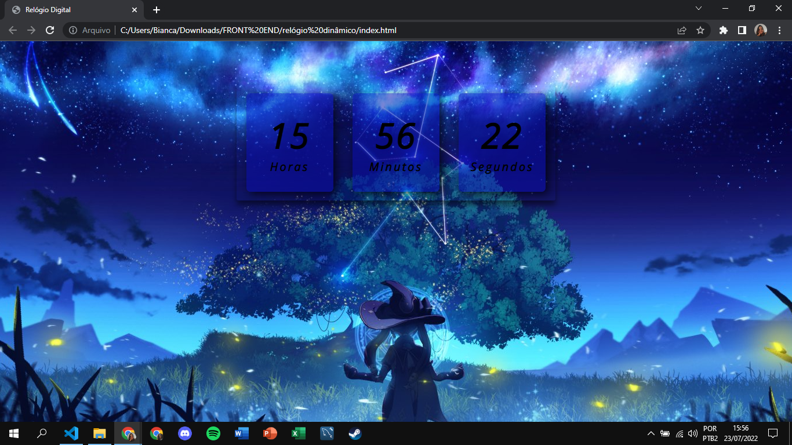

# Relogio Digital ⏰

  • Projeto realizado seguindo o tutorial da Larissa Kich como forma de treinar html, css e javascript, sendo este último citado uma maior dificuldade para mim, por isso estou começando com projetos "leves" para meu treinamento!! :D 
  
  • Vídeo como base: https://www.youtube.com/watch?v=GK0ok3ZCXwM

  • 
